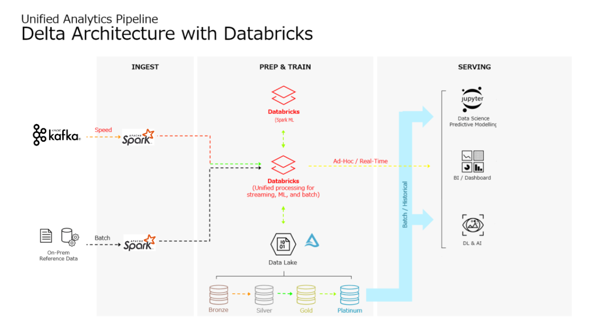

# Restaurant Recommendation System - Delta Architecture

### ETL Data Engineering + Machine Learning Project

Last updated: 20 Nov 2022
### Introduction
As an avid-user of recommedation system and a big fan of food in general, I have always been curious about 2 things:
1. What makes certain restaurants popular? Is there a way to quantify and even predict what makes restaurants popular?
2. How does the recommendation algorithm work? In this project, we will expand what attributes decide the famous of restaurants and this thing may be effect to the degree accuracy of recommendation systems ?

We then realised that the Yelp datasets, this dataset is a subset of Yelp's businesses, reviews, and user data. It was originally put together for the Yelp Dataset Challenge which is a chance for students to conduct research or analysis on Yelp's data and share their discoveries. In the most recent dataset you'll find information about businesses across 8 metropolitan areas in the USA and Canada.

Given the vast amount of review of Yelp's business, we want to be able to handle large amounts of data. Therefore, We decided to use this as an opportunity to learn and use Apache Spark, through Delta Architecture in ETL progress. This project will be done on Databricks. The data will also be stored on Databricks itself, through its data lake, Delta Lake. The machine learning models used will be from the pyspark.ml package, which works with PySpark dataframes.

This project will be split into the following parts:
1. Methodology
2. Data Engineering - ETL Pipeline to streaming data from Yelp'datasets into Delta Lake( Bronze, Silver, Gold, Platinum)
3. EDA
4. ALS model to recommend restaurant popularity
6. Conclusion

### Architecture

### Databricks Notebook

- [This notebook](https://databricks-prod-cloudfront.cloud.databricks.com/public/4027ec902e239c93eaaa8714f173bcfc/4011400051450228/2812886958038011/6010338227229174/latest.html) is the main file for this project that runs on the Databricks Platform. Beside, it also have 4 Kafka files.
- For training notebook, visit [this notebook](https://databricks-prod-cloudfront.cloud.databricks.com/public/4027ec902e239c93eaaa8714f173bcfc/4011400051450228/2169768177882707/6010338227229174/latest.html).

### Running project

Import `dbc` files to databricks before running. Or import `Delta-Architecture.dbc` to import full source files.
Run the files in sequential order `Install_Kafka` > `Kafka_Server_Start` > `Kafka_Producer` > `Kafka_Consumer`